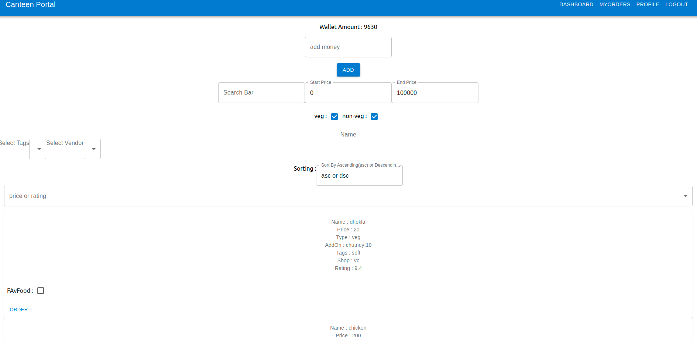

# JUICE CANTEEN 



The Food Ordering Portal is a web application built using the MERN stack that allows:

## Customers

* To order food items from a list of available items sold by vendors
* To view, manage and edit personal profiles
* To view status of orders placed by them and pick up orders from vendors

## Vendors

* To put food items up for sale, where they can be ordered by customers
* To view, manage and edit personal profiles
* To view and manage orders placed by customers and update their status as the orders progress
* View statistics and distribution of orders placed by customers and sales completed by them

The Food Ordering Portal supports two types of accounts: vendors and customers.

## Features

* User authentication and authorization using JWT.
* Fuzzy search for food items
* Filtering and sorting food items based on various attributes
* Email confirmation for acceptance/rejection of orders
* Adding and removing favourite food items

## Requirements

* Node.js
* Express.js
* MongoDB
* React.js

## Setup

* Clone the repository.

* Change directory to the root of the repository.

```
cd Food-Ordering-Portal
```
* From the cloned directory, run cd backend and run the following command:
```
cp .env.template .env
```
* Now, all you need to do is run the following command from the root of the cloned directory:

```
docker-compose up -d
```
The application will now be running on http://localhost:80.

Running

```docker-compose down```
will stop the application.
